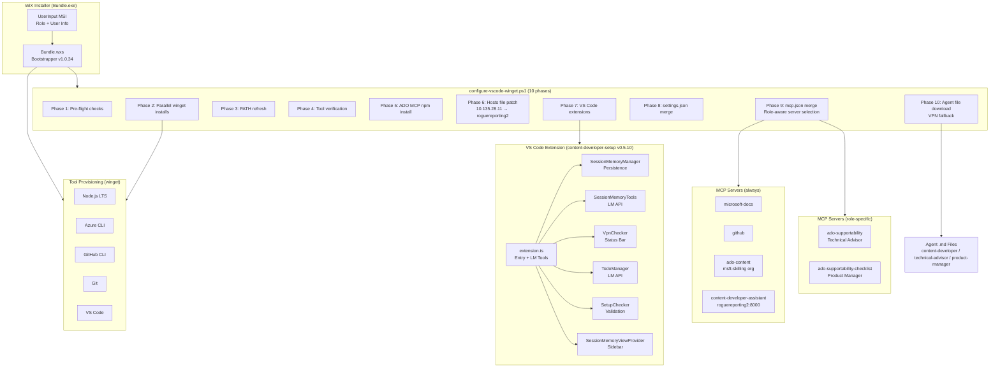
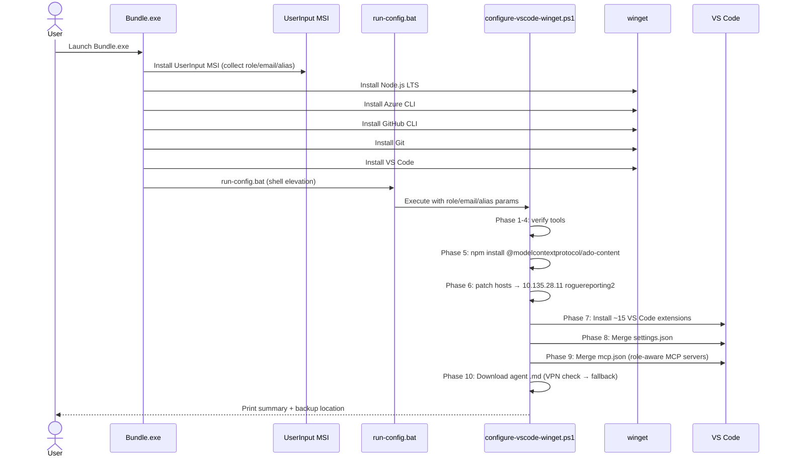
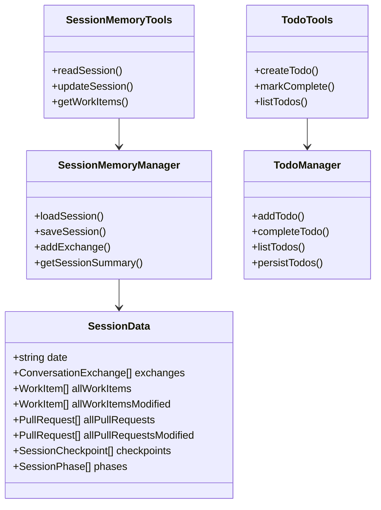

# Repo Recon: content-developer-installer

**Date**: 2025-07-10  
**Version Analyzed**: v1.0.34  
**Skill**: repo-recon  
**Repo Path**: `c:\github\content-developer-installer`

---

## Executive Summary

`content-developer-installer` is a **Windows-only, role-aware developer environment bootstrapper** purpose-built for Azure documentation team members (Content Developer, Technical Advisor, Product Manager). It combines a WiX v3.14 GUI installer, a 700-line PowerShell orchestration script, and a VS Code extension to deliver a repeatable, opinionated onboarding experience.

The installer provisions five system tools via `winget`, configures VS Code (extensions, settings, MCP servers, agent files), patches the Windows `hosts` file for an internal MCP server, and installs a VS Code extension that exposes session memory, a todo manager, VPN detection, and 11+ Language Model tools to Copilot agents. Role selection at install time gates which MCP tools and agent definitions are deployed.

**Key findings:**
- The VS Code extension (12 TypeScript files, ~185 KB source) is the highest-value artifact — it is entirely portable and installable without the WiX installer.
- The PowerShell script is ~80% reproducible as a `winget configure` YAML file + a small DSC resource module.
- The WiX packaging layer adds GUI polish and an upgrade path but supplies zero logic beyond sequencing.
- The `hosts` file patch and internal MCP identity headers are the only components with no clean managed replacement.
- Microsoft Dev Box (now converging with Windows 365) could own the tool provisioning and host-file concerns at the infrastructure level, reducing this repo to an agent-configuration layer.

---

## Phase 1 — Repository Manifest

### File Count

| Metric | Value |
|--------|-------|
| Total files | 80 |
| Source lines (est.) | ~6,500 (TS) + ~700 (PS1) + ~400 (WiX XML) |
| Binary files | 11 (`.wixobj`, `.wixpdb`, `.msi`, `.bmp`, `.ico`) |

### Extension Histogram

| Extension | Count | Layer |
|-----------|-------|-------|
| `.md` | 18 | Docs / agent definitions / skills |
| `.ts` | 12 | VS Code extension source |
| `.ps1` | 10 | Installer + configuration scripts |
| `.wixobj` | 9 | WiX build artifacts (compiled) |
| `.wxs` | 6 | WiX installer source |
| `.bmp` | 6 | Installer graphics |
| `.json` | 4 | Extension manifest, tsconfig, resources |
| `.wixpdb` | 3 | WiX linker symbols |
| `.msi` | 2 | Compiled installer packages |
| `.bat` | 2 | Installer batch launchers |
| `.py` | 1 | Session extraction utility |
| `.html` | 1 | Monthly report template |
| `.ico` | 1 | Application icon |

---

## Phase 2 — Component Analysis

### Component Extraction Table

| Component | File(s) | Purpose | Portability | Risk |
|-----------|---------|---------|-------------|------|
| **WiX Bundle** | `installer/Bundle.wxs` | GUI bootstrapper, 7-step install chain | Low — Windows + WiX only | If dropped: lose GUI UX, upgrade detection |
| **WiX Product MSI** | `installer/Product.wxs` | UserInput UI dialogs, role capture, file payload | Low | Contains role selection logic; would need UI replacement |
| **UI Dialogs** | `installer/ExtensionDialog.wxs`, `UserInfoDialog.wxs`, `UserInput.wxs`, `VPNWarningDialog.wxs` | Role + extension picker, VPN warning, user info | Low | WiX-specific; data (role, email, alias) feeds PS1 |
| **Build script** | `installer/build-msi.ps1` | Compiles WiX sources, produces Bundle.exe | CI only | No runtime dependency |
| **Core config script** | `installer/configure-vscode-winget.ps1` | 700-line 10-phase orchestration (tools, VS Code, MCP, hosts) | **Medium** — PS1 is portable to any Windows PS session | Hosts file patch requires admin; internal MCP URL is internal-only |
| **Sandbox installer** | `installer/install-winget-sandbox.ps1` | Installs inside Windows Sandbox for testing | Dev-only | None |
| **Agent definitions** | `installer/content-developer.agent.md`, `technical-advisor.agent.md`, `product-manager.agent.md` | Copilot Chat agent metadata (tools, capabilities) | **High** — plain Markdown/YAML | Could live in a GitHub repo and be `git clone`d |
| **Skills** | `skills/session-summary/SKILL.md`, `skills/monthly-report/SKILL.md` | Structured AI workflows for reporting | **High** | Standalone; distributable via repo |
| **Extension entry** | `vscode-extension/src/extension.ts` | Command registration, LM tool wiring, sidebar, status bars | **High** — VSIX distributable | Depends on VS Code API; not usable outside VS Code |
| **Setup checker** | `vscode-extension/src/setup-checker.ts` | Validates installed tools at extension activation | **High** | Pure TS, no native deps |
| **Tool installer** | `vscode-extension/src/tool-installer.ts` | Installs missing tools via `winget` at runtime | **High** | Invokes `winget`; Windows-only |
| **VPN checker** | `vscode-extension/src/vpn-checker.ts` | Detects `MSFT-AzVPN-Manual` adapter | Medium | Windows-specific; would need rework for non-Windows |
| **Session memory** | `vscode-extension/src/session-memory/SessionMemoryManager.ts` | Persists session data to `~/.content-developer/sessions/` | **High** | Self-contained, no external deps |
| **Session tools** | `vscode-extension/src/session-memory/SessionMemoryTools.ts` | LM tools for session read/write | **High** | Depends only on SessionMemoryManager |
| **Session view** | `vscode-extension/src/session-memory/SessionMemoryViewProvider.ts` | TreeView sidebar provider | **High** | VS Code API only |
| **Chat parser** | `vscode-extension/src/session-memory/ChatSessionParser.ts` | Parses VS Code chat session log JSON | **High** | Reads `%APPDATA%\Code\User\workspaceStorage` |
| **CLI checkpoint parser** | `vscode-extension/src/session-memory/CliCheckpointParser.ts` | Parses checkpoint files from CLI watchers | **High** | File I/O only |
| **Todo manager** | `vscode-extension/src/session-memory/TodoManager.ts` | Todo list with persistence | **High** | Self-contained |
| **Todo tools** | `vscode-extension/src/session-memory/TodoTools.ts` | LM tools for todo CRUD | **High** | Thin wrapper over TodoManager |
| **Session index** | `vscode-extension/src/session-memory/index.ts` | Barrel export | **High** | Trivial |
| **Monthly report template** | `skills/monthly-report/templates/monthly-report-template.html` | HTML report scaffold | **High** | Static file |
| **Session extract script** | `skills/session-summary/scripts/extract-session.py` | Python helper to extract session logs | **High** | Standalone, Python 3 |

---

## Phase 3 — Similar Projects

| Project | URL | Overlap | Differentiator |
|---------|-----|---------|----------------|
| **WinGet Configuration (DSC)** | [learn.microsoft.com](https://learn.microsoft.com/en-us/windows/package-manager/configuration/) | Tool provisioning, VS Code extensions, settings via YAML+DSC | Declarative, no GUI installer needed; replaces most of configure-vscode-winget.ps1 |
| **Microsoft Dev Box** | [learn.microsoft.com](https://learn.microsoft.com/en-us/azure/dev-box/) | Cloud-hosted ready-to-code workstations with YAML image definitions | Handles provisioning at image level; emerging Windows 365 integration; no MCP config support yet |
| **Dev Home** | [github.com/microsoft/devhome](https://github.com/microsoft/devhome) | Windows dev environment dashboard; WinGet integration, clone repos, configure machine | GUI-based; doesn't handle VS Code AI agent config |
| **Boxstarter** | [boxstarter.org](https://boxstarter.org) | Chocolatey-based Windows env bootstrap with reboot handling | No VS Code-specific awareness; requires Chocolatey ecosystem |
| **Dotfiles managers** (e.g., `chezmoi`) | [chezmoi.io](https://www.chezmoi.io) | Manage dotfiles, settings, and config files across machines | Cross-platform; no WinGet orchestration; would handle mcp.json, settings.json |
| **VS Code Profile Sync** | Built-in VS Code feature | Syncs extensions, settings, keybindings across machines | Handles extension/settings layer; no tool provisioning, no MCP server config, no Copilot agent files |

---

## Phase 4 — Architecture Diagrams

### System Architecture



### Install Workflow



### VS Code Extension Data Model



---

## Risks & Gaps

| Risk | Severity | Detail |
|------|----------|--------|
| **Hosts file dependency** | High | `roguereporting2:8000` must map to `10.135.28.11` via `C:\Windows\System32\drivers\etc\hosts`. Requires admin. Bypassed by DNS or Azure Private DNS if infrastructure allows. |
| **Internal MCP server availability** | High | `content-developer-assistant` MCP is internal-only (VPN-gated). Extension has a VPN status bar but setup fails silently if VPN is absent during install. |
| **mcp.json overwrite** | Medium | VS Code can silently overwrite `mcp.json` when a workspace is opened that contains a `.vscode/mcp.json`. Installer saves a backup to `%PUBLIC%\Desktop\mcp.json` but recovery is manual. |
| **WiX v3 EOL** | Medium | WiX v3 is in maintenance mode. WiX v4/v5 have breaking changes. Migration effort is moderate but not urgent unless upgrading toolchain. |
| **BUGS.md BUG-001** | Low-Medium | `SessionMemoryManager` logs PRs and work items from LM tool call *arguments* before confirming success. Partial mitigation via `isError` checks in PR #15/#17, but text-pattern capture accepted as known limitation. |
| **Role selection immutability** | Medium | Role is captured once at install time. Changing roles requires re-running the installer. |
| **Windows-only** | Low (for target users) | All team members are on Windows. If team expands to macOS, VS Code extension and most scripts are portable but WiX and hosts-patching are not. |
| **Node.js version pinning** | Low | Bundle installs "Node.js LTS" (unpinned). ADO MCP npm package could break with a major Node upgrade. |

---

## Phase 5 — "Can I Do This Without All the Scripting and Installation?"

### Requirement Decomposition

| Requirement | Current Approach | Alternative | Verdict |
|-------------|-----------------|-------------|---------|
| **Install system tools** (Node.js, Azure CLI, GitHub CLI, Git, VS Code) | WiX bundle → `winget install` | `winget configure` YAML via DSC | **GO** — 1:1 replacement |
| **Install VS Code extensions** | PS1 `code --install-extension` loop | `winget configure` with `Microsoft.WinGet.DSC/WinGetPackage` + VS Code Profile Sync | **GO** — DSC or profile sync both work |
| **Configure VS Code settings** | PS1 JSON merge into `settings.json` | Committed `.vscode/settings.json` in repo + VS Code Settings Sync | **GO** — repo-committed settings are portable and versionable |
| **Deploy MCP configuration** | PS1 merges `mcp.json` at install time | Committed `.vscode/mcp.json` in team repo | **GO** — MCP JSON committed to workspace/user settings repo; opened automatically |
| **Role-aware MCP server selection** | Install-time role dialog → conditional PS1 logic | Multiple workspace profiles or per-role repo branches | **CONDITIONAL** — VS Code doesn't have native "role mode"; could use separate repos or a setup script that copies the right mcp.json |
| **Deploy Copilot agent files** | Bundle payload → copy to `%APPDATA%\Code\User\prompts\` | `git clone` a shared prompts repo OR VS Code team policy | **GO** — agent `.md` files are portable; just need to land in the prompts folder |
| **Deploy skills** | Bundle payload | Same `git clone` approach; skills live in `.github` repo | **GO** |
| **Patch hosts file** | PS1 admin block writes `10.135.28.11 roguereporting2` | Azure Private DNS zone or split-tunnel DNS | **CONDITIONAL** — if the team can control DNS, hosts patching is eliminated. Otherwise a one-time manual step or Intune-deployed config |
| **Install VS Code extension (VSIX)** | PS1 `code --install-extension` | Publish extension to VS Code Marketplace (private or public) | **GO** — marketplace install is one command |
| **Session memory & LM tools** | VS Code extension | VS Code extension (this doesn't change; extension is the delivery mechanism) | **NO-GO for eliminating** — extension is the value; only the *installer* can be eliminated |
| **VPN detection** | Extension `vpn-checker.ts` | Extension continues to do this | n/a |
| **Identity headers in MCP** | PS1 injects email/alias as env vars for MCP server config | Entra ID token in MCP auth header | **CONDITIONAL** — depends on internal MCP server's auth model |
| **GUI install wizard** | WiX dialogs | None needed if distribution is via `winget configure` | **GO** — eliminate WiX entirely |
| **Upgrade / uninstall** | WiX registry-tracked upgrade | Re-run `winget configure`; extension auto-updates via marketplace | **GO** |

### Recommended Architecture (Scripting-Light Version)

```
team-setup/
├── configure.yaml          ← winget DSC: install Node.js, Az CLI, GitHub CLI, Git, VS Code, extensions
├── .vscode/
│   ├── settings.json       ← team VS Code settings (committed)
│   └── mcp.json            ← MCP server config (committed, role variants as branches or overlays)
└── README.md               ← "Run: winget configure configure.yaml"

Agent files → already in .github repo, synced to %APPDATA%\Code\User\prompts\ by extension or a one-liner
VS Code extension → published to marketplace, installed by configure.yaml DSC resource
Hosts file → replaced by Azure Private DNS / Intune DNS push
```

**What remains non-trivial:**
1. The `hosts` file patch — push via Intune or DNS infrastructure
2. Role-gated MCP config — needs a small decision point (role selection via prompt or env var) unless roles are simplified to a single profile
3. The VS Code extension itself — still needs to be built and published; installer just changes from WiX to marketplace

### Overall Verdict

| Dimension | Current | Alternative |
|-----------|---------|-------------|
| Onboarding friction | High (400MB installer, admin req) | Low (`winget configure configure.yaml`) |
| Maintainability | Medium (WiX XML + PS1) | High (YAML + TypeScript only) |
| Upgrade story | WiX upgrade codes | marketplace auto-update + re-run DSC |
| Role customization | Install-time dialog | Branch-per-role or env var |
| Infrastructure dependencies | Hosts file + VPN | DNS + VPN (same) |
| Portability | Windows only | Windows only (same) |

**Bottom line**: You can eliminate the WiX installer and ~80% of the PowerShell scripting by converting to a `winget configure` YAML + committed settings files + VS Code Marketplace extension. The remaining 20% is the hosts-file patch (infrastructure concern) and role-gated config (a branch or env-var pattern). The VS Code extension is irreplaceable as a runtime artifact — only its *delivery mechanism* changes.

---

*Generated by repo-recon skill — `c:\github\content-developer-installer` @ v1.0.34*
